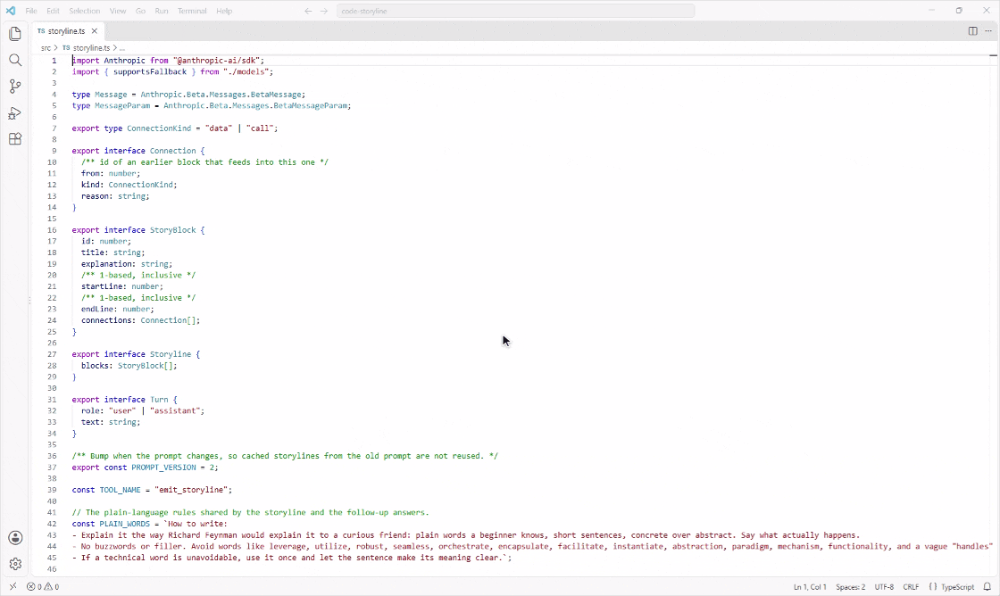

# code storyline

**Read your code as a story.** a vs code extension that explains any code file step by step, in plain words. click a part to see its code and ask follow-up questions.

<!-- Screen recording goes here: replace the line below with a GIF or MP4, e.g.  -->
> 🎬 **Demo coming soon.** A short screen recording of code storyline in action will live here.

---

## Why

Opening an unfamiliar file usually means scrolling up and down trying to work out what calls what. code storyline does that first pass for you:

- **The story, in order.** The file becomes 3 to 10 parts, read left to right. Each card shows a short title, one sentence on what it does and why it's there, and the exact lines of code.
- **Plain words, no buzzwords.** Explanations are written the way you'd explain code to a curious friend: short sentences, everyday words, no jargon.
- **How the pieces connect.** Arrows show which earlier part a step depends on: solid arcs above the row when it uses **data** from there, dashed arcs below when it **calls** code there. Every connection is also written out in words.
- **Ask about any part.** Click a card and a panel opens. Ask your own question or tap `explain it simpler`, `go one level deeper` or `why is this here?`, then keep going. Answers stream in and point at real line numbers.
- **Jump to the code when you want to.** If the file is open next to the storyline, clicking a card highlights its lines there. Press `show in code` in the panel to bring the file up at those lines.
- **Move around like a canvas.** Drag to move, ctrl + scroll (⌘ + scroll on Mac) or pinch to zoom, or use the `−` `100%` `+` buttons. Click `100%` to fit the whole story on screen.
- **Pick your model.** The `MODEL` button in the top bar lists the Claude models in plain words, with a rough cost for each.
- **Saved, with history.** Every storyline is saved per file, together with your questions and answers, and survives restarts. Reopening a file shows its saved storyline instantly and for free; if you've edited the file since, a short note offers an `update` instead of spending money on its own. The `history` button lists the last 10 storylines of the file, so you can go back to any of them.
- **Calm to look at.** A light grey canvas and clean white cards in every VS Code theme. The only colour is in the code: light grey code blocks where just the highlighted words are blue, with a copy button and line numbers.
- **No backend.** Everything runs inside VS Code. Your code goes straight from your editor to the Anthropic API with your own key, and nowhere else.

## Install

1. Install **code storyline** from the VS Code Marketplace (or run `code --install-extension code-storyline-<version>.vsix` with a downloaded build).
2. Open any file, press `Ctrl+Shift+P` / `Cmd+Shift+P` and run **Show Code Storyline**.

## Set your API key

code storyline uses Claude, so it needs an [Anthropic API key](https://console.anthropic.com/).

1. Press `Ctrl+Shift+P` / `Cmd+Shift+P` and run **Code Storyline: Set API Key**.
2. Paste your key into the hidden box and press Enter.

The key is kept in VS Code's encrypted secret storage on your computer, never in `settings.json` (which is plain text and may be synced to the cloud). If you run **Show Code Storyline** without a key, the panel offers `set api key` too. **Code Storyline: Remove API Key** deletes it again. Without a stored key, the extension uses the `ANTHROPIC_API_KEY` environment variable.

Upgrading from an earlier version that kept the key in the `codestoryline.apiKey` setting? It's moved into the encrypted storage and removed from your settings automatically.

## Choose a model

Click the `MODEL` button in the storyline's top bar, or run **Code Storyline: Choose Model** from the Command Palette. You get a short list:

| Model | Good for | Rough cost per storyline* |
| --- | --- | --- |
| Claude Haiku 4.5 | Short, simple files; fastest | about 1¢ |
| Claude Sonnet 5.5 (default) | A good everyday choice | about 2¢ |
| Claude Sonnet 4.5 | The older Sonnet, quick and clear | about 3¢ |
| Claude Opus 5.5 | Long or tricky files | about 5¢ |
| Claude Fable 5.1 | The hardest code; slowest | 10¢ or more |

\*For a file of about 300 lines. Follow-up questions cost a fraction of that.

Choosing a model shows that model's storyline right away. You can also type any other Claude model id, or set `codestoryline.model` in Settings.

> **Privacy note:** making a storyline and asking a follow-up question both send the full contents of the file to the Anthropic API. Don't use it on files you aren't allowed to share with a third-party service. Saved storylines, including a copy of the file text they were made from, stay on your computer in VS Code's private storage for the extension, never in your project. Delete a file's history from its `history` list.

## Roadmap

- [ ] A list of every file that has a saved storyline
- [ ] Share storylines with your team by saving them in the project
- [ ] Storylines for a selection, a folder, or a whole pull request diff
- [ ] Follow the cursor: highlight the box for the code you're currently reading
- [ ] Mark stale storylines when the file changes, and refresh incrementally
- [ ] Export the diagram as SVG or PNG for docs and code reviews
- [ ] Better layout for very large files (zoom, minimap, collapsible groups)
- [ ] Cross-file storylines that follow calls into imported modules
- [ ] Localised explanations

Have an idea? [Open an issue](https://github.com/tarekwady/code-storyline/issues).

## Contributing

Pull requests are welcome. See [CONTRIBUTING.md](CONTRIBUTING.md) for how to run and debug the extension locally.

## License

[MIT](LICENSE)
